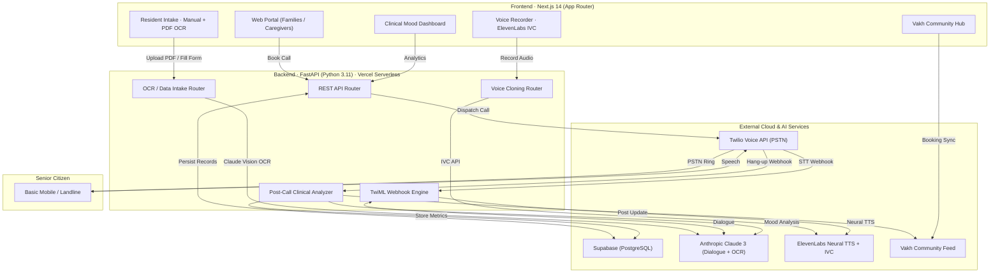

<p align="center">
  
</p>

<h1 align="center">Calmie · AI Phone Companion for Senior Citizens</h1>

<p align="center">
  <strong>"The world forgot to call. We didn't."</strong><br>
  <em>Warm, deeply personalised AI phone calls for senior citizens in Indian old age homes.</em>
</p>

<p align="center">
  <a href="./LICENSE"></a>
  <a href="https://calmie-lol.vercel.app"></a>
  <a href="https://github.com/brovk2008/Calmie"></a>
  <a href="https://nextjs.org"></a>
  <a href="https://fastapi.tiangolo.com"></a>
  <a href="https://www.twilio.com"></a>
  <a href="https://supabase.com"></a>
  <a href="https://www.anthropic.com"></a>
  <a href="https://elevenlabs.io"></a>
</p>

<p align="center">
  <a href="https://calmie-lol.vercel.app" target="_blank">
    
  </a>
</p>

---

## 🌐 Live Deployment

| Resource | URL |
|---|---|
| 🚀 **Web Application** | [https://calmie-lol.vercel.app](https://calmie-lol.vercel.app) |
| 👥 **Residents Directory** | [https://calmie-lol.vercel.app/residents](https://calmie-lol.vercel.app/residents) |
| 📋 **Add Residents (Intake)** | [https://calmie-lol.vercel.app/intake](https://calmie-lol.vercel.app/intake) |
| 💬 **Vakh Community Hub** | [https://calmie-lol.vercel.app/vakh](https://calmie-lol.vercel.app/vakh) |
| 🩺 **Caseworker Dashboard** | [https://calmie-lol.vercel.app/dashboard](https://calmie-lol.vercel.app/dashboard) |
| 🏠 **Care Homes Directory** | [https://calmie-lol.vercel.app/homes](https://calmie-lol.vercel.app/homes) |
| ⚡ **Backend API Root** | [https://calmie-lol.vercel.app/api](https://calmie-lol.vercel.app/api) |
| 📖 **Swagger API Docs** | [https://calmie-lol.vercel.app/docs](https://calmie-lol.vercel.app/docs) |
| 🩺 **Health Check** | [https://calmie-lol.vercel.app/api/health](https://calmie-lol.vercel.app/api/health) |
| 📄 **Download Intake Template PDF** | [https://calmie-lol.vercel.app/api/intake/template](https://calmie-lol.vercel.app/api/intake/template) |

---

## 📖 Table of Contents

- [🌟 The Mission](#-the-mission)
- [🏗️ System Architecture](#️-system-architecture)
- [💻 Complete Tech Stack](#-complete-tech-stack)
- [🚀 Core Features](#-core-features)
  - [1. Live AI Outbound Telephony](#1--live-ai-outbound-telephony)
  - [2. Elder Profiles & Contextual Memory](#2--elder-profiles--contextual-memory)
  - [3. Mood & Loneliness Tracking](#3--clinical-mood--loneliness-tracking)
  - [4. Smart Booking & Scheduler](#4--smart-booking--auto-scheduler)
  - [5. Vakh Community Integration](#5--vakh-community-integration--slot-booking)
  - [6. Voice Cloning (NEW)](#6--voice-cloning-via-elevenlabs-ivc)
  - [7. Resident Data Intake via OCR (NEW)](#7--resident-data-intake-via-ocr--pdf)
- [🔌 Services & Integrations](#-services--integrations-deep-dive)
- [🔄 Call Flow](#-interactive-telephony-flow)
- [🗄️ Database Schema](#️-database-schema)
- [📡 API Reference](#-api-reference)
- [🔑 Environment Variables](#-environment-variables)
- [🛠️ Local Development Setup](#️-local-development-setup)
- [🚀 Deployment on Vercel](#-deployment-on-vercel)
- [📄 License](#-license)

---

## 🌟 The Mission

Over **15 million elderly people in India** live in severe isolation or old-age homes. Most do not own smartphones, cannot navigate apps, and struggle with touchscreens due to tremors, arthritis, or failing eyesight. What they have is a basic feature phone or landline — and a deep longing for someone to ask, *"Aapne khana khaya?"* (*Did you eat?*).

**Calmie** brings companion care directly to their existing phones through automated, scheduled PSTN calls. No apps to install. No internet needed on the senior's end. Just pick up the ringing phone and talk to an empathetic voice that listens in Hindi or English, remembers their stories, tracks their emotional well-being, and keeps their families informed.

---

## 🏗️ System Architecture



---

## 💻 Complete Tech Stack

| Layer | Technology | Version | Purpose |
|---|---|---|---|
| **Frontend Framework** | [Next.js](https://nextjs.org) (App Router) | `14.2` | Server-rendered UI, dynamic routes |
| **Frontend Runtime** | [React](https://react.dev) / [TypeScript](https://www.typescriptlang.org) | `18.3` | Typed component architecture |
| **Styling** | [Tailwind CSS](https://tailwindcss.com) | `3.4` | Neo-Brutalist custom theme |
| **Icons** | [Lucide React](https://lucide.dev) | `^0.460` | UI icons |
| **Backend Framework** | [FastAPI](https://fastapi.tiangolo.com) | `0.110` | Async ASGI REST API |
| **Backend Server** | [Uvicorn](https://www.uvicorn.org) | `0.28` | Production ASGI server |
| **Language Runtime** | [Python](https://python.org) | `3.11` | Backend runtime |
| **HTTP Client** | [HTTPX](https://www.python-httpx.org) | `0.27` | Async HTTP to all external APIs |
| **Telephony** | [Twilio Voice SDK](https://www.twilio.com/docs/voice) | `9.x` | PSTN calling, TwiML, speech gather |
| **Database** | [Supabase PostgreSQL](https://supabase.com) | Cloud REST | Persistent storage with in-memory fallback |
| **LLM Reasoning** | [Anthropic Claude 3](https://www.anthropic.com) | Haiku / Sonnet | Dialogue, post-call analysis, OCR parsing |
| **Voice Synthesis** | [ElevenLabs](https://elevenlabs.io) Multilingual v2 | REST API | Ultra-realistic TTS + Instant Voice Cloning |
| **Native Voice** | Amazon Polly (via Twilio) | Neural | Low-latency Hindi (`Aditi`) / English (`Matthew`) |
| **Community Feed** | [Vakh](https://vakh.com) Social Feed | MCP / REST | Family updates, community call booking |
| **PDF Generation** | [ReportLab](https://docs.reportlab.com) | `4.1` | Resident intake template PDF |
| **PDF Text Extraction** | [pdfplumber](https://github.com/jsvine/pdfplumber) | `0.10` | Digital PDF text extraction for OCR |
| **PDF to Image** | [PyMuPDF](https://pymupdf.readthedocs.io) | `1.24` | Convert scanned PDFs to images for Vision |
| **Hosting** | [Vercel](https://vercel.com) | Serverless | Monorepo hosting — Next.js + FastAPI |

---

## 🚀 Core Features

### 1. 📞 Live AI Outbound Telephony

Enter any Indian phone number on the booking page to immediately schedule or trigger an AI companion phone call. The senior receives a normal incoming call, picks up, and speaks naturally in **Hindi or English**. No app, no smartphone, no internet required on their end.

- Twilio PSTN dials `+91` numbers directly
- TwiML `<Gather speech>` captures voice with Hindi/English speech recognition  
- Claude generates warm, contextual responses in real-time
- Conversation loops naturally for 5–15 minutes

**Try booking a call:** [https://calmie-lol.vercel.app/residents](https://calmie-lol.vercel.app/residents)

---

### 2. 👵 Elder Profiles & Contextual Memory

Each resident has a rich profile the AI reads before dialing:

- Personal backstory, hometown memories, hobbies
- Native language preferences (Hindi, Hinglish, Punjabi, English)
- Health notes (hearing loss, diabetes, mobility limitations)
- Topics to explore / topics to avoid
- Family context (who visits, who calls, relationship dynamics)

**View the directory:** [https://calmie-lol.vercel.app/residents](https://calmie-lol.vercel.app/residents)

---

### 3. 🧠 Clinical Mood & Loneliness Tracking

Every conversation is audited post-call by Claude for wellness indicators:

| Signal | What it Detects |
|---|---|
| **Mood Score (1–5)** | Distress → Neutral → Vibrant |
| **Loneliness Flag** | Mentions of feeling forgotten, isolation, wishing family visited |
| **Urgent Flag** | Pain, fall, missed medication, severe distress |
| **Summary** | 2-sentence family-ready call recap |
| **Favourite Moment** | The highlight of the conversation |

**View the dashboard:** [https://calmie-lol.vercel.app/dashboard](https://calmie-lol.vercel.app/dashboard)

---

### 4. 📅 Smart Booking & Auto-Scheduler

Family members can schedule one-off or recurring calls at a specific date & time. The scheduler automatically triggers the call at the right moment.

- Pick a resident → choose date/time → confirm booking
- Booking stored in Supabase, scheduler fires at trigger time
- Full confirmation screen with booking ID

**Book a call:** [https://calmie-lol.vercel.app/residents](https://calmie-lol.vercel.app/residents) → any resident → *Schedule Call*

---

### 5. 💬 Vakh Community Integration & Slot Booking

Calmie integrates with [Vakh](https://vakh.com), an Indian community social feed, enabling community-driven call booking:

- **Senior Codes** — every resident has a unique `CLM-RAMESH` style code visible on their profile
- **Vakh Post Reply Booking** — community members reply to a Vakh post with the code + time → Calmie auto-books
- **Vakh Form Booking** — fill a Vakh-embedded form with the senior code + preferred time
- **Automated sync** — bookings created via Vakh appear in the Calmie scheduler instantly

**Vakh Hub:** [https://calmie-lol.vercel.app/vakh](https://calmie-lol.vercel.app/vakh)

---

### 6. 🎙️ Voice Cloning via ElevenLabs IVC *(New!)*

Family members who can't be physically present can now make the AI call the senior **in their own voice**:

1. Go to any resident's detail page
2. Click **"Record My Voice"** in the dark *"Call in Your Own Voice"* panel  
3. Speak naturally for 30–60 seconds (browser mic, no install needed)
4. Check the consent box and click **"Use My Voice"**
5. ElevenLabs Instant Voice Cloning creates a voice clone
6. Future calls to that senior use your cloned voice

**APIs:**

| Method | Endpoint | Description |
|---|---|---|
| `POST` | [`/api/voice/clone`](https://calmie-lol.vercel.app/docs#/voice/create_voice_clone_api_voice_clone_post) | Upload audio → ElevenLabs IVC → returns `voice_id` |
| `GET` | [`/api/voice/clones`](https://calmie-lol.vercel.app/docs#/voice/list_clones_api_voice_clones_get) | List all Calmie voice clones |
| `DELETE` | `/api/voice/clone/{voice_id}` | Remove a voice clone |

---

### 7. 📄 Resident Data Intake via OCR & PDF *(New!)*

Old-age homes keep paper records. Calmie eliminates manual data entry:

**Download the blank intake form PDF:**  
👉 [https://calmie-lol.vercel.app/api/intake/template](https://calmie-lol.vercel.app/api/intake/template)

**Two intake modes:**

| Mode | URL | How It Works |
|---|---|---|
| **Manual Form** | [/intake/manual](https://calmie-lol.vercel.app/intake/manual) | 4-step guided web form per resident |
| **Bulk PDF Upload** | [/intake/upload](https://calmie-lol.vercel.app/intake/upload) | Drag & drop PDF/image → Claude Vision OCR → preview & confirm |

**OCR Pipeline:**
- Digital PDFs → `pdfplumber` extracts text → Claude Haiku parses structured JSON
- Scanned/handwritten PDFs → `PyMuPDF` converts pages to PNG → Claude Sonnet Vision reads the form → JSON

**APIs:**

| Method | Endpoint | Description |
|---|---|---|
| `GET` | [`/api/intake/template`](https://calmie-lol.vercel.app/api/intake/template) | Download blank intake form PDF |
| `POST` | `/api/intake/resident` | Create single resident via JSON |
| `POST` | `/api/intake/upload` | Upload PDF/image → OCR preview |
| `POST` | `/api/intake/bulk-confirm` | Commit previewed residents to DB |

**Intake Portal:** [https://calmie-lol.vercel.app/intake](https://calmie-lol.vercel.app/intake)

---

## 🔌 Services & Integrations Deep-Dive

### 1. Twilio Programmable Voice · PSTN Telephony
- **Files:** [`backend/services/twilio_service.py`](./backend/services/twilio_service.py) · [`backend/routers/twiml.py`](./backend/routers/twiml.py)
- Bridges cloud infrastructure to India's PSTN — dials `+91` mobile/landline numbers directly
- `<Gather input="speech" language="hi-IN en-IN">` captures bilingual voice input
- Status callbacks on hang-up trigger Claude post-call analysis
- Verified Caller ID: `+91 98214 00274` (live pilot number)

### 2. Supabase · Relational Database
- **File:** [`backend/supabase_client.py`](./backend/supabase_client.py)
- Async PostgREST client (`httpx.AsyncClient`) — no blocking in serverless
- **Zero-failure in-memory fallback** — if Supabase is unreachable, pre-seeded demo residents (Ramesh Tiwari, Kamla Devi, Col. Harbhajan Singh) keep the system running
- Tables: `care_homes`, `residents`, `bookings`, `calls`, `availability`

### 3. Anthropic Claude · AI Brain
- **Files:** [`backend/services/claude_service.py`](./backend/services/claude_service.py) · [`backend/services/ocr_service.py`](./backend/services/ocr_service.py)
- **Dialogue (Claude 3 Haiku):** Real-time conversational turns, warm Indian honorifics (*Ji*, *Beta*, *Sat Sri Akal*), 1–3 sentence responses optimised for phone listening
- **Post-call analysis (Haiku):** Mood score, loneliness flag, urgent flag, family summary
- **OCR parsing (Haiku / Sonnet Vision):** Extracts structured resident data from filled PDF forms — handles both digital text and handwritten scans

### 4. ElevenLabs · Neural TTS + Instant Voice Cloning
- **File:** [`backend/services/elevenlabs_service.py`](./backend/services/elevenlabs_service.py)
- **TTS:** `eleven_multilingual_v2` model, 14 Indian-accented voices (Aria/Anjura, Ria, Rashi, Priya, Saanu, Rith, AB, Ashish, Pranab, Arjun/Kabir)
- **IVC:** `POST /v1/voices/add` with multipart audio → returns `voice_id` in seconds
- Audio streamed via `/api/twiml/tts` into Twilio `<Play>` tags

### 5. Amazon Polly · Low-Latency TwiML Voice
- **File:** [`backend/routers/twiml.py`](./backend/routers/twiml.py)
- Fallback when ElevenLabs is not configured
- `Polly.Aditi` (Indian Hindi female) · `Polly.Matthew` (English male)
- Zero additional latency — native to Twilio TwiML `<Say>` tags

### 6. Vakh · Community Social Feed
- **Files:** [`backend/services/vakh_service.py`](./backend/services/vakh_service.py) · [`backend/routers/vakh.py`](./backend/routers/vakh.py)
- Community endpoint: `https://xo.vakh.com/mcp`
- Posts privacy-safe call summaries after each call completes
- Parses incoming Vakh replies/forms to extract booking details (senior code, time, name, phone)
- Senior codes (`CLM-RAMESH`, `CLM-KAMLA`, `CLM-HARBHAJAN`) enable fuzzy community resolution

### 7. ReportLab · PDF Template Generator
- **File:** [`backend/services/template_generator.py`](./backend/services/template_generator.py)
- Pure-Python, zero-binary — works on Vercel serverless
- Generates a branded, printable Calmie Resident Intake Form with 4 sections: Basic Info, Life Story, Health & Family, Photo
- Served at [`GET /api/intake/template`](https://calmie-lol.vercel.app/api/intake/template)

---

## 🔄 Interactive Telephony Flow

```
[Book Call] ──► Twilio dials Senior's phone (+91 XXXXX XXXXX)
                       │
                       ▼
             Senior picks up receiver
                       │
                       ▼
    Twilio → GET /api/twiml/welcome?booking_id=...
                       │
                       ▼
    TwiML: <Gather language="hi-IN en-IN">
             <Say voice="Polly.Aditi">
               "Namaste Ramesh ji! Kaise hain aap aaj?"
             </Say>
           </Gather>
                       │
                       ▼
        Senior: "Haan beta, aaj guthno mein dard tha."
                       │
                       ▼
    Twilio STT → POST /api/twiml/gather
                       │
                       ▼
    Claude 3 Haiku (with full resident context):
      → "Arre Ramesh ji, mausam badal raha hai. Aapne
         subah garam haldi wala doodh piya kya?"
                       │
                       ▼
    ElevenLabs TTS → <Play>/api/twiml/tts?text=...</Play>
                       │
           (Loop continues 5–15 minutes)
                       │
                       ▼
              Call ends / hangs up
                       │
         ┌─────────────┴─────────────┐
         ▼                           ▼
  Claude sentiment audit      Vakh community post
  - Mood: 4/5                 "Ramesh ji had a lovely
  - Loneliness: false          chat about cricket today!"
  - Urgent: false
         │
         ▼
  Saved to Supabase → Dashboard updated
```

---

## 🗄️ Database Schema

```sql
-- Old Age Homes
CREATE TABLE care_homes (
    id UUID PRIMARY KEY DEFAULT gen_random_uuid(),
    name TEXT NOT NULL,
    city TEXT,
    address TEXT,
    contact_phone TEXT,
    contact_email TEXT,
    approved BOOLEAN DEFAULT false,
    created_at TIMESTAMPTZ DEFAULT now()
);

-- Residents (Senior Citizens)
CREATE TABLE residents (
    id UUID PRIMARY KEY DEFAULT gen_random_uuid(),
    home_id UUID REFERENCES care_homes(id),
    name TEXT NOT NULL,
    code TEXT,                        -- e.g. CLM-RAMESH (unique Vakh code)
    age INT,
    phone TEXT,
    room_number TEXT,
    photo_url TEXT,
    hometown TEXT,
    preferred_lang TEXT,
    hobbies TEXT,
    favorite_topics TEXT,
    avoid_topics TEXT,
    health_notes TEXT,
    family_notes TEXT,
    personality TEXT,
    emergency_contact TEXT,
    vakh_form_id TEXT,
    active BOOLEAN DEFAULT true,
    created_at TIMESTAMPTZ DEFAULT now()
);

-- Bookings (Scheduled Call Appointments)
CREATE TABLE bookings (
    id UUID PRIMARY KEY DEFAULT gen_random_uuid(),
    resident_id UUID REFERENCES residents(id),
    caller_name TEXT,
    caller_phone TEXT,
    scheduled_time TIMESTAMPTZ,
    status TEXT DEFAULT 'confirmed',  -- confirmed, in_progress, completed, cancelled
    voice_id TEXT,                    -- optional cloned voice ID
    special_notes TEXT,
    source TEXT DEFAULT 'web',        -- web, vakh_reply, vakh_form
    created_at TIMESTAMPTZ DEFAULT now()
);

-- Calls (Telemetry & Transcripts)
CREATE TABLE calls (
    id UUID PRIMARY KEY DEFAULT gen_random_uuid(),
    booking_id UUID REFERENCES bookings(id),
    resident_id UUID REFERENCES residents(id),
    twilio_call_sid TEXT,
    duration_seconds INT DEFAULT 0,
    transcript TEXT,
    mood_score INT,                   -- 1 to 5
    loneliness_flag BOOLEAN DEFAULT false,
    urgent_flag BOOLEAN DEFAULT false,
    urgent_reason TEXT,
    summary TEXT,
    favorite_moment TEXT,
    status TEXT DEFAULT 'initiated',
    created_at TIMESTAMPTZ DEFAULT now()
);

-- Availability (Preferred Calling Windows)
CREATE TABLE availability (
    id UUID PRIMARY KEY DEFAULT gen_random_uuid(),
    resident_id UUID REFERENCES residents(id),
    day_of_week INT,                  -- 0 = Sunday, 6 = Saturday
    start_time TIME,
    end_time TIME,
    active BOOLEAN DEFAULT true
);
```

---

## 📡 API Reference

Full interactive docs: **[https://calmie-lol.vercel.app/docs](https://calmie-lol.vercel.app/docs)**

### Telephony & Calls · `/api/calls`
| Method | Endpoint | Description |
|---|---|---|
| `POST` | `/api/calls/trigger/{booking_id}` | Trigger immediate outbound Twilio call |
| `POST` | `/api/calls/{call_id}/complete` | Hang-up webhook; runs Claude sentiment analysis |
| `GET` | `/api/calls` | List recent call records with mood scores |
| `GET` | `/api/calls/{call_id}` | Get call transcript, summary, and metrics |
| `GET` | `/api/calls/stats/overview` | Aggregated analytics |

### TwiML Webhooks · `/api/twiml`
| Method | Endpoint | Description |
|---|---|---|
| `POST/GET` | `/api/twiml/welcome` | Entry-point — greeting + `<Gather>` |
| `POST` | `/api/twiml/gather` | Speech input handler → Claude dialogue |
| `GET` | `/api/twiml/tts` | ElevenLabs TTS audio proxy |

### Bookings · `/api/bookings`
| Method | Endpoint | Description |
|---|---|---|
| `GET` | `/api/bookings` | All bookings |
| `POST` | `/api/bookings` | Create new scheduled call |
| `GET` | `/api/bookings/{id}` | Booking metadata |
| `PATCH` | `/api/bookings/{id}/status` | Update booking status |

### Residents & Homes
| Method | Endpoint | Description |
|---|---|---|
| `GET` | `/api/residents` | Residents directory |
| `GET` | `/api/residents/{id}` | Resident profile + call history |
| `POST` | `/api/residents` | Enrol a new resident |
| `GET` | `/api/homes` | Registered care homes |

### Voice Cloning · `/api/voice`
| Method | Endpoint | Description |
|---|---|---|
| `POST` | `/api/voice/clone` | Upload audio → ElevenLabs IVC → `voice_id` |
| `GET` | `/api/voice/clones` | List all Calmie voice clones |
| `DELETE` | `/api/voice/clone/{voice_id}` | Delete a voice clone |

### Resident Intake / OCR · `/api/intake`
| Method | Endpoint | Description |
|---|---|---|
| `GET` | [`/api/intake/template`](https://calmie-lol.vercel.app/api/intake/template) | Download blank intake form PDF |
| `POST` | `/api/intake/resident` | Create resident via JSON form |
| `POST` | `/api/intake/upload` | Upload PDF/image → Claude Vision OCR preview |
| `POST` | `/api/intake/bulk-confirm` | Commit OCR-previewed residents to DB |

### Vakh Community · `/api/vakh`
| Method | Endpoint | Description |
|---|---|---|
| `POST` | `/api/vakh/book` | Book a call via Vakh reply payload |
| `POST` | `/api/vakh/form-submit` | Book a call via Vakh form submission |
| `GET` | `/api/vakh/bookings` | List all Vakh-sourced bookings |

---

## 🔑 Environment Variables

Copy `.env.example` to `.env`:

```bash
cp .env.example .env
```

| Variable | Required | Service | Purpose |
|---|---|---|---|
| `TWILIO_ACCOUNT_SID` | **Yes** | Twilio | Account SID (`AC...`) |
| `TWILIO_AUTH_TOKEN` | **Yes** | Twilio | Auth token |
| `TWILIO_PHONE_NUMBER` | **Yes** | Twilio | Twilio purchased number |
| `TWILIO_API_KEY_SID` | Optional | Twilio | API Key SID for browser client |
| `TWILIO_API_SECRET` | Optional | Twilio | API Key Secret |
| `TWILIO_VERIFIED_CALLER_ID` | Optional | Twilio | Verified number for trial accounts |
| `SUPABASE_URL` | **Yes** | Supabase | Project REST URL (`https://xyz.supabase.co`) |
| `SUPABASE_ANON_KEY` | **Yes** | Supabase | Anon public API key |
| `SUPABASE_PROJECT_ID` | Optional | Supabase | Project ID string |
| `ANTHROPIC_API_KEY` | **Yes** | Anthropic | Claude API key (`sk-ant-...`) |
| `ELEVENLABS_API_KEY` | **Yes** | ElevenLabs | API key for TTS + IVC |
| `ELEVENLABS_VOICE_ID` | Optional | ElevenLabs | Default voice ID |
| `ELEVENLABS_AGENT_ID` | Optional | ElevenLabs | Conversational agent ID |
| `VAKH_MCP_URL` | Optional | Vakh | Feed endpoint (`https://xo.vakh.com/mcp`) |
| `VAKH_API_TOKEN` | Optional | Vakh | Auth token for Vakh posting |
| `BASE_URL` | Optional | Server | Public URL (e.g. `https://calmie-lol.vercel.app`) |
| `NEXT_PUBLIC_API_URL` | Optional | Frontend | Backend base URL |

---

## 🛠️ Local Development Setup

### Prerequisites
- **Node.js** `>= 18.17`
- **Python** `>= 3.11`
- **npm** or **pnpm**
- **ngrok** — required to receive Twilio webhooks locally

### 1. Clone

```bash
git clone https://github.com/brovk2008/Calmie.git
cd Calmie
```

### 2. Configure Environment

```bash
cp .env.example .env
# Fill in your Twilio, Anthropic, Supabase, and ElevenLabs credentials
```

### 3. Backend (FastAPI)

```bash
# Create virtual environment
python -m venv venv

# Activate (Windows PowerShell)
.\venv\Scripts\Activate.ps1
# Activate (macOS / Linux)
source venv/bin/activate

# Install dependencies
pip install -r requirements.txt

# Start server
uvicorn backend.main:app --reload --port 8000
```

Interactive API docs → [http://localhost:8000/docs](http://localhost:8000/docs)

### 4. Frontend (Next.js)

```bash
cd frontend
npm install
npm run dev
```

Open → [http://localhost:3000](http://localhost:3000)

### 5. Expose Webhooks (Twilio requires a public URL)

```bash
ngrok http 8000
```

Copy the ngrok URL (e.g. `https://abc-123.ngrok-free.app`) and set `BASE_URL` in `.env`.

---

## 🚀 Deployment on Vercel

Calmie is a zero-config serverless monorepo — both Next.js and FastAPI deploy from the same repo.

> 🌐 **Production:** [https://calmie-lol.vercel.app](https://calmie-lol.vercel.app)  
> 📦 **GitHub:** [https://github.com/brovk2008/Calmie](https://github.com/brovk2008/Calmie)

1. **Push to GitHub** — Vercel auto-deploys on every push to `main`
2. **Import on Vercel** → [vercel.com/new](https://vercel.com/new) → select `brovk2008/Calmie`
3. **Add env vars** in Vercel Project Settings → Environment Variables
4. **Deploy** — Vercel builds Next.js via `@vercel/next` and FastAPI via `@vercel/python`

The [`vercel.json`](./vercel.json) at the root handles all route rewrites:
- `/api/(.*)` → FastAPI Python serverless function
- Everything else → Next.js

---

## 📄 License

```
Copyright 2026 Calmie Team (brovk2008)

Licensed under the Apache License, Version 2.0 (the "License");
you may not use this file except in compliance with the License.
You may obtain a copy of the License at

    http://www.apache.org/licenses/LICENSE-2.0
```

Calmie is free, open-source software under the **Apache License 2.0**. Use, modify, and build on it freely — see the full [LICENSE](./LICENSE) file.

---

<p align="center">
  <br>
  <strong>Calmie</strong> · Dedicated to the golden generation of India.<br>
  <a href="https://calmie-lol.vercel.app">calmie-lol.vercel.app</a> · <a href="https://github.com/brovk2008/Calmie">github.com/brovk2008/Calmie</a>
</p>
